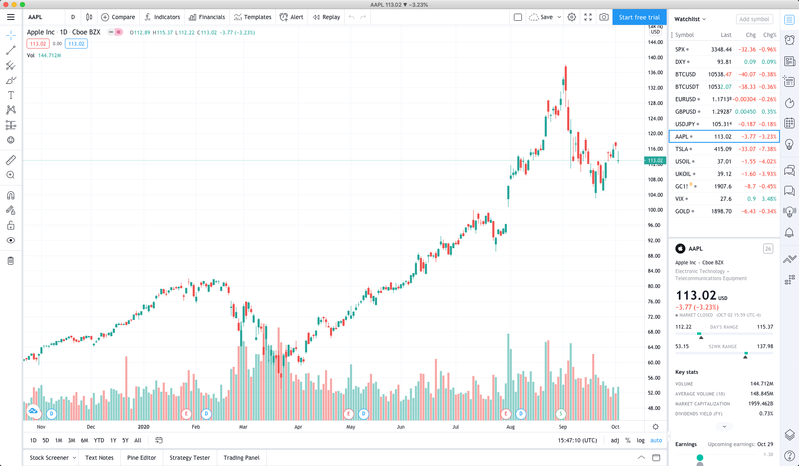

# 非官方 TradingView 桌面版

非官方 TradingView 桌面版使用 [Electron](https://www.electronjs.org) 构建



# 如何构建

* 安装 [Node.js](https://nodejs.org)

* Clone 本仓库

  ```bash
  git clone https://github.com/themarketwizard/tradingview-desktop.git
  ```

* 进入文件夹

  ```bash
  cd tradingview-desktop
  ```

* 下载 electron

  ```bash
  npm install
  ```

* 构建

  ```bash
  npm run build
  ```

---
欢迎加入`交易奇才 Slack 交流群`，让我们一起成为更好的交易者！


> 可扫码关注公众号，并回复：**加群**